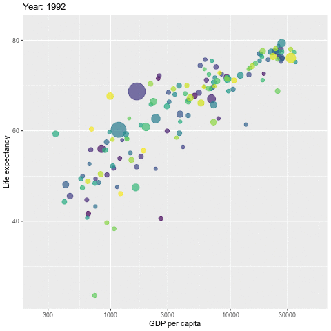

ggplot 基本图像
=============================================
```{r}
library(ggplot2)
a <- ggplot(economics, aes(date,unemploy))
head(economics)
b <- ggplot(seals, aes(x=long, y=lat))
head(seals)

a + geom_blank()
a + geom_path(lineend = "butt", linejoin = "round", linemitre = 1)
a + geom_polygon()
b + geom_rect(aes(xmin=long, ymin=lat, xmax=long+1, ymax=lat+1))
b + geom_rect(aes(xmin=-160, ymin=35, xmax=-120, ymax=45))
a + geom_ribbon(aes(ymin=unemploy-900, ymax=unemploy+900))
```

单一变量 连续
===========================================
```{r}
c <- ggplot(mpg, aes(hwy))
c2 <- ggplot(mpg)
c + geom_area(stat = "bin")
c + geom_density(kernel='gaussian')
c + geom_dotplot()
c + geom_freqpoly()
c + geom_histogram(binwidth = 5)
c2 + geom_qq(aes(sample=hwy))
```
单一变量 离散
=========================================== 
```{r}
d <- ggplot(mpg, aes(fl))
d + geom_bar()
```


双变量:连续x、连续y
============================================
```{r}
e <- ggplot(mpg, aes(cty, hwy))
e + geom_point()
e + geom_point(aes(color=trans))
e + geom_jitter(aes(color=trans))
e + geom_text(aes(label=cty))
e + geom_label(aes(label=cty))
e + geom_quantile()
e + geom_rug(sides = "bl")
e + geom_smooth(method = lm)
```

双变量:离散x,连续y
============================================
```{r}
f <- ggplot(mpg, aes(class, hwy))
f + geom_col(fill="blue")
f + geom_boxplot(color="blue")
f + geom_dotplot(binaxis = "y", stackdir = "center")
f + geom_violin(scale = "area")
```

双变量:离散x,离散y
============================================
```{r}
g <- ggplot(diamonds, aes(cut, color))
g + geom_count()
```

连续二元分布
=============================================
```{r}
h <- ggplot(diamonds, aes(carat, price))
h + geom_bin2d(binwidth=c(0.25, 500))
h + geom_density2d()

#install.packages("hexbin")
h + geom_hex()
```

连续函数
=============================================
```{r}
i <- ggplot(economics, aes(date, unemploy))
i + geom_area()
i + geom_line()
i + geom_step(direction = "hv")
```

误差的呈现方式
============================================
```{r}
library(dplyr)
set.seed(100)
real_df <- data.frame(grp=rep(c("A", "B", "C"),c(3, 3, 3)), 
                 value=c(rnorm(3, mean=3, sd=1), 
                         rnorm(3, mean=9, sd=2),
                         rnorm(3, mean=15, sd=3)))
std <- function(x) sd(x)/sqrt(length(x))
# shortcut is "Shift + Ctrl + m"
df <- real_df %>% group_by(grp) %>% summarise(fit=mean(value), se=std(value))
j <- ggplot(df, aes(grp, fit, ymin=fit-se, ymax=fit+se))
j + geom_crossbar(fatten=2, width=0.1)
j + geom_errorbar(width=0.1)
j + geom_linerange()
j + geom_pointrange()

j + geom_col(aes(fill=grp), width = 0.5) + geom_errorbar(width=0.1) + geom_path(aes(group=1))
```

地图
============================================
```{r}
data <- data.frame(murder=USArrests$Murder,
                   state=tolower(rownames(USArrests)))
#install.packages("maps")
map <- map_data("state")
k <- ggplot(data,aes(fill=murder))
k + geom_map(aes(map_id=state), map=map) + expand_limits(x=map$long, y=map$lat)
```

三变量
============================================
```{r}
seals$z <- with(seals, sqrt(delta_long^2 + delta_lat^2))
l <- ggplot(seals, aes(long, lat))
l + geom_contour(aes(z=z))
l + geom_raster(aes(fill=z))
l + geom_tile(aes(fill=z))
```

统计变换(另一种构建图层的方法)
============================================
```{r}
#i + stat_density2d(aes(fill=..level..), geom="polygon")
c + stat_bin(binwidth = 1, origin=10)
c + stat_count(width = 1)

```


ggplot + geom_point 绘制气泡图
=============================================
```{r, echo=FALSE}
library(tidyverse)
```
```{r}
library(gapminder)
gapminder %>%
  filter(year==2007) %>%
  ggplot(aes(
    #log(gdpPercap), 
    gdpPercap,
    lifeExp, size = pop, color=continent)) +
  geom_point(alpha = 0.7) + 
  theme_bw()

gapminder %>%
  filter(year > 1990) %>%
  ggplot(aes(
    #log(gdpPercap), 
    gdpPercap,
    lifeExp, size = pop, color=continent)) +
  geom_point(alpha = 0.7) + 
  theme_bw() +
  facet_wrap(~year)
```

```{r, gganimate = list(nframes = 50, fps = 20)}
library(gganimate)
p <- gapminder %>%
  filter(year > 1990) %>%
  ggplot(aes(x = gdpPercap, y=lifeExp, size = pop, colour = country)) +
  geom_point(show.legend = FALSE, alpha = 0.7) +
  scale_color_viridis_d() +
  scale_size(range = c(2, 12)) +
  scale_x_log10() +
  labs(x = "GDP per capita", y = "Life expectancy") +
  transition_time(year) +
  labs(title = "Year: {frame_time}")
#anim_save("p.gif", p)
```


ggplot + geom_violin + geom_boxplot
===========================================
```{r}
library(ggplot2)

# create a dataset
set.seed(100)
data <- data.frame(
  name=c( rep("A",500), rep("B",500), rep("B",500), rep("C",20), rep('D', 100)  ),
  value=c( rnorm(500, 10, 5), rnorm(500, 13, 1), rnorm(500, 18, 1), rnorm(20, 25, 4), rnorm(100, 12, 1) )
)

p <- ggplot(data, aes(x=name, y=value, fill=name)) +
    geom_violin(width=1.4) +
    geom_boxplot(width=0.1, color="grey", alpha=0.2) +
    theme(
      legend.position="none",
      plot.title = element_text(size=11)
    ) +
    ggtitle("A Violin wrapping a boxplot") +
    xlab("")
p
```

```{r}
x  <- seq(-7, 10, length = 200)
y1 <- dnorm(x, mean = 0,sd = 1)
y2 <- dnorm(x, mean = 3,sd = 2)

df4 <- data.frame(x, y1, y2)

ggplot(df4, aes(x = x)) +
  geom_line(aes(y = y1), colour = 'blue') +
  geom_line(aes(y = y2), colour = 'red') +
  geom_area(aes(y = pmin(y1, y2)), fill = 'gray60')
```

ggplot + geom_bar + coord_polar 类似南丁格尔图（玫瑰图）
========================================================
```{r}
# library
library(tidyverse)
 
# Create dataset
data <- data.frame(
  individual=paste( "Mister ", seq(1,60), sep=""),
  group=c( rep('A', 10), rep('B', 30), rep('C', 14), rep('D', 6)) ,
  value=sample( seq(10,100), 60, replace=T)
)

 
# Set a number of 'empty bar' to add at the end of each group
empty_bar <- 4
to_add <- data.frame( matrix(NA, empty_bar*nlevels(data$group), ncol(data)) )
colnames(to_add) <- colnames(data)
to_add$group <- rep(levels(data$group), each=empty_bar)
data <- rbind(data, to_add)
data <- data %>% arrange(group)
data$id <- seq(1, nrow(data))
 
# Get the name and the y position of each label
label_data <- data
number_of_bar <- nrow(label_data)
angle <- 90 - 360 * (label_data$id-0.5) /number_of_bar     # I substract 0.5 because the letter must have the angle of the center of the bars. Not extreme right(1) or extreme left (0)
label_data$hjust <- ifelse( angle < -90, 1, 0)
label_data$angle <- ifelse(angle < -90, angle+180, angle)
 
# Make the plot
p <- ggplot(data, aes(x=as.factor(id), y=value, fill=group)) +       # Note that id is a factor. If x is numeric, there is some space between the first bar
  geom_bar(stat="identity", alpha=0.5, position = "stack") +
  ylim(-100,120) +
  theme_minimal() +
  theme(
    legend.position = "none",
    axis.text = element_blank(),
    axis.title = element_blank(),
    panel.grid = element_blank(),
    plot.margin = unit(rep(-1,4), "cm") 
  ) +
  coord_polar() + 
  geom_text(data=label_data, aes(x=id, y=value+10, label=individual, hjust=hjust), color="black", fontface="bold",alpha=0.6, size=2.5, angle= label_data$angle, inherit.aes = FALSE ) 
 
p
```
